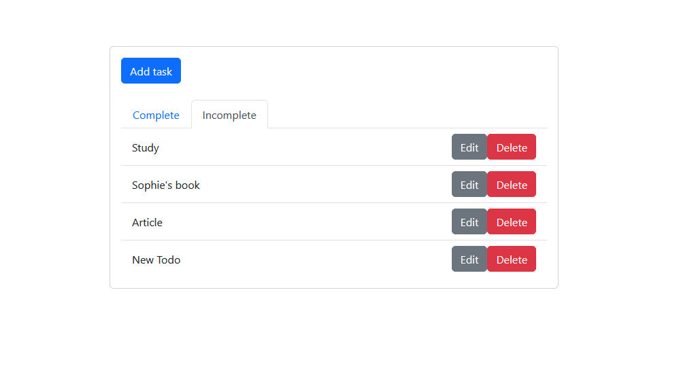
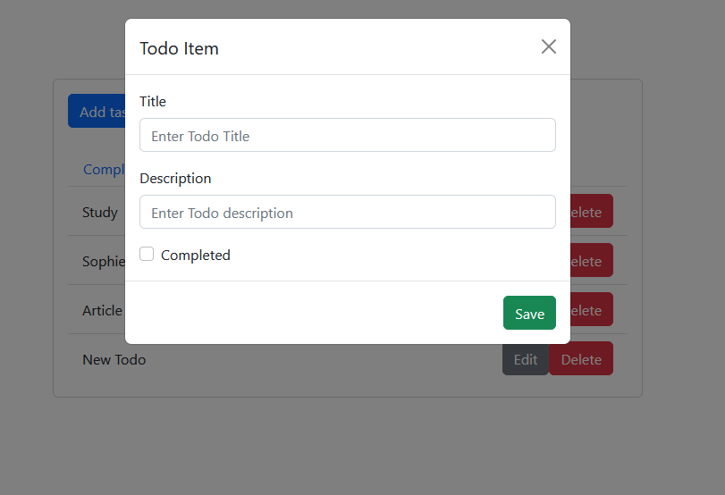
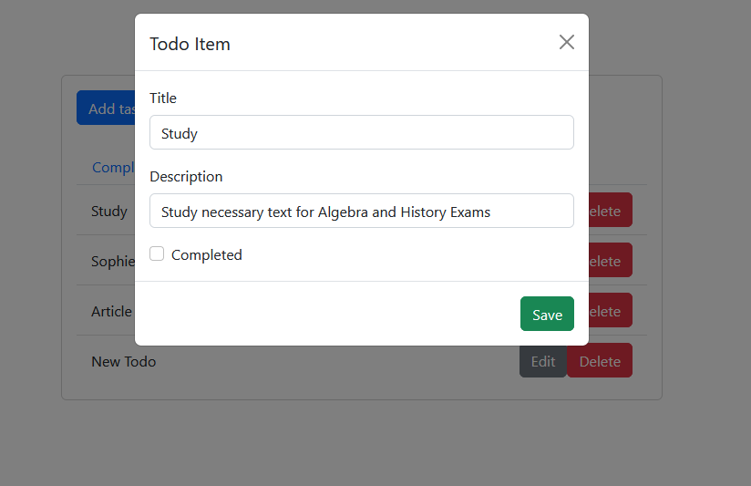

# TODO list

This todo list is made with Django/Django REST for the backend part. And the frontend part is made with React. 

You can add a new goal in the todo list :

You can also edit the differents goal into the list : 

